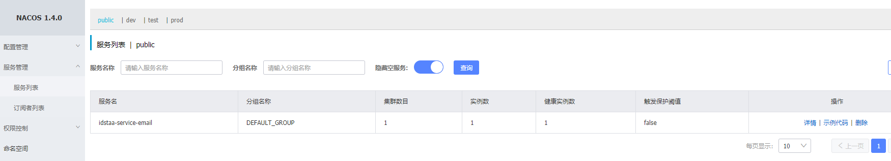
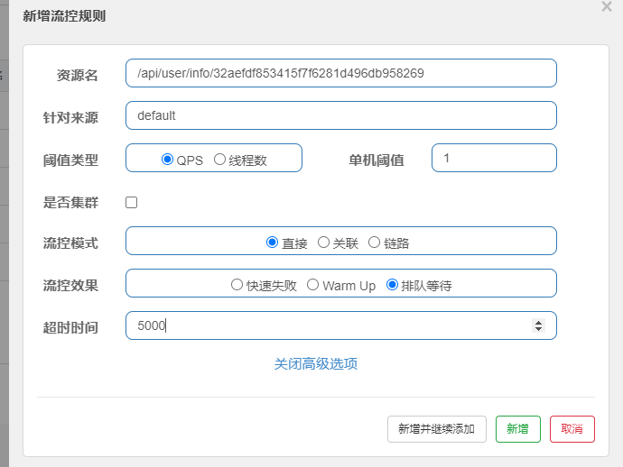
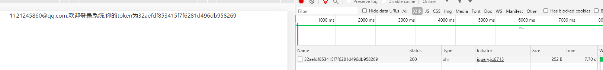

# 3-5模块 SpringCloud作业-登录注册项目改造为nacos + dubbo + sentinel

## **一、编程题：**

根据如下描述，改造Spring Cloud（上）的作业，完成以下要求：

1、Eureka注册中心  替换为  Nacos注册中心

2、Config+Bus配置中心  替换为 Nacos配置中心

3、Feign调用 替换为 Dubbo RPC调用

4、使用Sentinel对GateWay网关的入口资源进行限流（限流参数自定义并完成测试即可）   


注意：1）所有替换组件使用单节点即可

\------------------------------------------------------------------------------------

作业资料说明：


1、提供资料：代码工程、验证及讲解视频。

2、讲解内容包含：题目分析、实现思路、代码讲解。

3、效果展示：

- Eureka注册中心 替换为 Nacos注册中心
- Config+Bus配置中心 替换为 Nacos配置中心
- Feign调用 替换为 Dubbo RPC调用
- 使用Sentinel对GateWay网关的入口资源进行限流（限流参数自定义并完成测试即可） 

\-------------------------------------------------------------------------------------------

## 二、思路分析

## 2.1、项目框架搭建，参考SpringCloud上

https://github.com/xjdm/springcloud_login.git   github项目地址

去掉了一个eureka_8082节点，修改parent项目名为springcloud_login-nacos，修改子工程依赖的父工程，导入到idea


参考架构


## 2.2 、Eureka注册中心 替换为 Nacos注册中心，发布dubbo服务

### 2.2.1 父工程改造

pom 去掉eureka依赖，去掉spring-boot-devtools 的包

### 2.2.2 email_9190项目改造

##### pom去掉Eureka依赖，替换为nacos，同时引入dubbo的依赖

```xml
        <dependency>
            <groupId>com.alibaba.cloud</groupId>
            <artifactId>spring-cloud-starter-alibaba-nacos-discovery</artifactId>
        </dependency>
        <dependency>
            <groupId>com.alibaba.cloud</groupId>
            <artifactId>spring-cloud-starter-alibaba-nacos-config</artifactId>
        </dependency>

        <dependency>
            <groupId>com.alibaba.csp</groupId>
            <artifactId>sentinel-apache-dubbo-adapter</artifactId>
        </dependency>
        <dependency>
            <groupId>com.idstaa</groupId>
            <artifactId>idstaa-dubbo-api</artifactId>
            <version>1.0-SNAPSHOT</version>
        </dependency>
```

##### application.yml去掉eureka 配置，增加nacos配置，并且改名为bootstrap.yml（这样便于数据库配置的加载，不然会找不到nacos中数据库的配置信息）

```yml
server:
  port: 9190
spring:
  application:
    name: idstaa-service-email
  main:
      allow-bean-definition-overriding: true
#  datasource:
#      driver-class-name: com.mysql.jdbc.Driver
#      url: jdbc:mysql://localhost:3306/lagou?useUnicode=true&characterEncoding=utf8&serverTimezone=UTC
#      username: root
#      password: root
  jpa:
    database: MySQL
    show-sql: true
    hibernate:
      naming:
        physical-strategy: org.hibernate.boot.model.naming.PhysicalNamingStrategyStandardImpl  #避免将驼峰命名转换为下划线命名
      jdbc.time_zone: UTC
  mail:
    host: smtp.qq.com #发送邮件服务器
    username: 1121245860@qq.com #发送邮件的邮箱地址
    password:  iieildpmrzytifaj #客户端授权码，不是邮箱密码，这个在qq邮箱设置里面自动生成的
    properties.mail.smtp.port: 587 #端口号465或587
    from: 1121245860@qq.com # 发送邮件的地址，和上面username一致
    debug: true
 #Nacos 配置
  cloud:
    nacos:
      discovery:
        ################ 配置nacos server地址
        server-addr: nacos.idstaa.com:8848
        #namespace: d80e4457-1263-4482-8715-0bd7f19836e5
      config:
        server-addr: nacos.idstaa.com:8848
        #namespace: d80e4457-1263-4482-8715-0bd7f19836e5 #命名空间
        group: DEFAULT_GROUP #默认分组就是DEFAULT_GROUP
        dataid: idstaa-service-email.yaml
        file-extension: yaml #扩展名
management:
    endpoints:
        web:
            exposure:
                include: "*"
dubbo:
    scan:
    # dubbo 服务扫描基准包
        base-packages: com.idstaa.service.impl
    protocol:
        # dubbo 协议
        name: dubbo
        # dubbo 协议端⼝（ -1 表示⾃增端⼝，从 20880 开始）
        port: -1
    registry:
    # 挂载到 Spring Cloud 的注册中⼼
        address: spring-cloud://localhost

```

##### 线上nacos 配置如下


##### 新建idstaa-dubbo-api模块,增加接口IdstaaEmailService

```java
public interface IdstaaEmailService {
    boolean sendEmail(String email,String code);
}
```

##### 删除EmailController，增加IdstaaEmailController.java，并增加dubbo注解@Service，发布成dubbo服务

```java
/**
 * @author chenjie
 * @date 2021/1/10 20:05
 */
@Service
public class IdstaaEmailServiceImpl implements IdstaaEmailService {
    @Autowired(required = true)
    private JavaMailSender mailSender;
    @Value("${spring.mail.from}")
    private String from;
    @Override
    public boolean sendEmail(String email, String code) {
        //创建SimpleMailMessage对象
        SimpleMailMessage message = new SimpleMailMessage();
        //邮件发送人
        message.setFrom(from);
        //邮件接收人
        message.setTo(email.split(";"));
        //邮件主题
        message.setSubject("【idstaa】springCloud登录注册短信验证码");
        //邮件内容
        message.setText("idstaa验证码："+code);
        //发送邮件
        mailSender.send(message);
        return true;
    }
}
```

启动类启动测试EmailApplication9190

启动成功上nacos服务上发现服务正常注册




进入详情发现dubbo接口也正常注册


至此，email服务改造完毕

### 2.2.3  消费端idstaa_service_code_8081 改造

pom.xml 导入jar，去掉eureka jar，导入nacos jar

```xml
<!--spring cloud alibaba dubbo 依赖-->
        <dependency>
            <groupId>com.alibaba.cloud</groupId>
            <artifactId>spring-cloud-starter-dubbo</artifactId>
        </dependency>
        <dependency>
            <groupId>com.alibaba.csp</groupId>
            <artifactId>sentinel-apache-dubbo-adapter</artifactId>
        </dependency>
        <dependency>
            <groupId>com.idstaa</groupId>
            <artifactId>idstaa-dubbo-api</artifactId>
            <version>1.1-SNAPSHOT</version>
        </dependency>
        <!-- 引入Druid依赖 -->
        <dependency>
            <groupId>com.alibaba</groupId>
            <artifactId>druid</artifactId>
            <version>1.0.29</version>
        </dependency>
        <dependency>
            <groupId>com.idstaa</groupId>
            <artifactId>idstaa_service_email_9190</artifactId>
            <version>1.1-SNAPSHOT</version>
        </dependency>
```

bootstrap.yml 

```yml
server:
  port: 8081
spring:
  application:
    name: idstaa-service-code
  main:
      allow-bean-definition-overriding: true
  jpa:
    database: MySQL
    show-sql: true
    hibernate:
      naming:
        physical-strategy: org.hibernate.boot.model.naming.PhysicalNamingStrategyStandardImpl  #避免将驼峰命名转换为下划线命名
      jdbc.time_zone: UTC
 #Nacos 配置
  cloud:
    nacos:
      discovery:
        ################ 配置nacos server地址
        server-addr: nacos.idstaa.com:8848
        #namespace: d80e4457-1263-4482-8715-0bd7f19836e5
      config:
        server-addr: nacos.idstaa.com:8848
        #namespace: d80e4457-1263-4482-8715-0bd7f19836e5 #命名空间
        group: DEFAULT_GROUP #默认分组就是DEFAULT_GROUP
        dataid: idstaa-service-code.yaml
        file-extension: yaml #扩展名
```

引入idstaaEmailService 服务

```java
@Reference
private IdstaaEmailService idstaaEmailService;
```

### 2.2.4  消费端idstaa_service_user_8081 改造

修改pom.xml，去除eureka 相关jar，增加nacos，dubbo相关jar

克隆nacos配置


修改application.yml 名称为bootstrap.yml

```yml
server:
  port: 8080
spring:
  application:
    name: idstaa-service-user
  jpa:
    database: MySQL
    show-sql: true
    hibernate:
      naming:
        physical-strategy: org.hibernate.boot.model.naming.PhysicalNamingStrategyStandardImpl  #避免将驼峰命名转换为下划线命名
      jdbc.time_zone: UTC
 #Nacos 配置
  cloud:
    nacos:
      discovery:
        ################ 配置nacos server地址
        server-addr: nacos.idstaa.com:8848
        #namespace: d80e4457-1263-4482-8715-0bd7f19836e5
      config:
        server-addr: nacos.idstaa.com:8848
        #namespace: d80e4457-1263-4482-8715-0bd7f19836e5 #命名空间
        group: DEFAULT_GROUP #默认分组就是DEFAULT_GROUP
        dataid: idstaa-service-user.yaml
        file-extension: yaml #扩展名
```


### 2.2.5 idstaa_service_gateway_9002 网关改造

#### 修改pom.xml

```xml
<dependencies>
        <dependency>
            <groupId>org.springframework.cloud</groupId>
            <artifactId>spring-cloud-commons</artifactId>
        </dependency>
        <!--GateWay 网关-->
        <dependency>
            <groupId>org.springframework.cloud</groupId>
            <artifactId>spring-cloud-starter-gateway</artifactId>
        </dependency>
        <!--引入webflux-->
        <dependency>
            <groupId>org.springframework.boot</groupId>
            <artifactId>spring-boot-starter-webflux</artifactId>
        </dependency>
        <!--日志依赖-->
        <dependency>
            <groupId>org.springframework.boot</groupId>
            <artifactId>spring-boot-starter-logging</artifactId>
        </dependency>
        <!--测试依赖-->
        <dependency>
            <groupId>org.springframework.boot</groupId>
            <artifactId>spring-boot-starter-test</artifactId>
            <scope>test</scope>
        </dependency>
        <!--lombok工具-->
        <dependency>
            <groupId>org.projectlombok</groupId>
            <artifactId>lombok</artifactId>
            <version>1.18.4</version>
            <scope>provided</scope>
        </dependency>

        <!--引入Jaxb，开始-->
        <dependency>
            <groupId>com.sun.xml.bind</groupId>
            <artifactId>jaxb-core</artifactId>
            <version>2.2.11</version>
        </dependency>
        <dependency>
            <groupId>javax.xml.bind</groupId>
            <artifactId>jaxb-api</artifactId>
        </dependency>
        <dependency>
            <groupId>com.sun.xml.bind</groupId>
            <artifactId>jaxb-impl</artifactId>
            <version>2.2.11</version>
        </dependency>
        <dependency>
            <groupId>org.glassfish.jaxb</groupId>
            <artifactId>jaxb-runtime</artifactId>
            <version>2.2.10-b140310.1920</version>
        </dependency>
        <dependency>
            <groupId>javax.activation</groupId>
            <artifactId>activation</artifactId>
            <version>1.1.1</version>
        </dependency>
        <!--引入Jaxb，结束-->

        <!-- Actuator可以帮助你监控和管理Spring Boot应用-->
        <dependency>
            <groupId>org.springframework.boot</groupId>
            <artifactId>spring-boot-starter-actuator</artifactId>
        </dependency>

        <dependency>
            <groupId>com.alibaba.cloud</groupId>
            <artifactId>spring-cloud-starter-alibaba-nacos-discovery</artifactId>
        </dependency>
        <!--sentinel 核⼼环境 依赖-->
        <dependency>
            <groupId>com.alibaba.cloud</groupId>
            <artifactId>spring-cloud-starter-alibaba-sentinel</artifactId>
        </dependency>
        <!-- Sentinel⽀持采⽤ Nacos 作为规则配置数据源，引⼊该适配依赖 -->
        <dependency>
            <groupId>com.alibaba.csp</groupId>
            <artifactId>sentinel-datasource-nacos</artifactId>
        </dependency>
    </dependencies>

    <dependencyManagement>
        <!--spring cloud依赖版本管理-->
        <dependencies>
            <dependency>
                <groupId>org.springframework.cloud</groupId>
                <artifactId>spring-cloud-dependencies</artifactId>
                <version>Greenwich.RELEASE</version>
                <type>pom</type>
                <scope>import</scope>
            </dependency>

            <!--SCA -->
            <dependency>
                <groupId>com.alibaba.cloud</groupId>
                <artifactId>spring-cloud-alibaba-dependencies</artifactId>
                <version>2.1.0.RELEASE</version>
                <type>pom</type>
                <scope>import</scope>
            </dependency>
        </dependencies>
    </dependencyManagement>

    <build>
        <plugins>
            <!--编译插件-->
            <plugin>
                <groupId>org.apache.maven.plugins</groupId>
                <artifactId>maven-compiler-plugin</artifactId>
                <configuration>
                    <target>11</target>
                    <target>11</target>
                    <encoding>utf-8</encoding>
                </configuration>
            </plugin>
            <!--打包插件-->
            <plugin>
                <groupId>org.springframework.boot</groupId>
                <artifactId>spring-boot-maven-plugin</artifactId>
            </plugin>
        </plugins>
    </build>
```

修改配置文件

```yml
server:
  port: 9002
spring:
  application:
     name: idstaa-cloud-gateway
  cloud:
    gateway:
      routes: # 路由可以有多个
        - id: service-autodeliver-router # 我们自定义的路由 ID，保持唯一
          uri: http://application.idstaa.com:8081  # 目标服务地址  自动投递微服务（部署多实例）  动态路由：uri配置的应该是一个服务名称，而不应该是一个具体的服务实例的地址
          #uri: lb://idstaa-service-code                                                                    # gateway网关从服务注册中心获取实例信息然后负载后路由
          predicates:                                         # 断言：路由条件，Predicate 接受一个输入参数，返回一个布尔值结果。该接口包含多种默 认方法来将 Predicate 组合成其他复杂的逻辑（比如：与，或，非）。
            - Path=/api/code/**
          filters:
             - StripPrefix=1 # 可以去掉api之后转发
        - id: service-resume-router      # 我们自定义的路由 ID，保持唯一
          #uri: http://127.0.0.1:8081       # 目标服务地址
          #http:localhost:8081/code/validate/673974833@qq.com/123456

          #http://127.0.0.1:8080/user/1545132
          uri: http://application.idstaa.com:8080
          predicates:                                         # 断言：路由条件，Predicate 接受一个输入参数，返回一个布尔值结果。该接口包含多种默 认方法来将 Predicate 组合成其他复杂的逻辑（比如：与，或，非）。
            - Path=/api/user/**
          filters:
            - StripPrefix=1 # 可以去掉api之后转发
    nacos:
      discovery:
        ################ 配置nacos server地址
        server-addr: nacos.idstaa.com:8848
        cluster-name: BJ
    sentinel:
      transport:
        dashboard: sentinel.idstaa.com:8080 # sentinel dashboard/console地址
        port: 8719 # sentinel会在该端⼝启动http server，那么这样的话，控制台定义的⼀些限流等规则才能发送传递过来，
        #如果8719端⼝被占⽤，那么会依次+1
```

配置文件需要助于uri 的编写，如果是部署到ucloud云无服务上，其他转发的注册中心的服务是内网地址，这时候gateway 转发调用会发现404 的错误，注意

uri 可以写死，配置成域名，而不用注册中心服务的名称，例如上述：**uri: lb://idstaa-service-code**     改成**uri: http://application.idstaa.com:8080**

### 2.2.6 补充说明，数据库动态刷新操作

```java
/**
 * @author chenjie
 * @date 2021/1/10 20:16
 */
@Slf4j
@Configuration
@RefreshScope
@Data
public class DruidConfiguration
{
    @Value("${spring.datasource.url}")
    private String dbUrl;

    @Value("${spring.datasource.username}")
    private String username;

    @Value("${spring.datasource.password}")
    private String password;

    @Value("${spring.datasource.driver-class-name}")
    private String driverClassName;

    @Bean
    @RefreshScope
    public DataSource dataSource()
    {
        DruidDataSource datasource = new DruidDataSource();
        datasource.setUrl(this.dbUrl);
        datasource.setUsername(username);
        datasource.setPassword(password);
        datasource.setDriverClassName(driverClassName);
        return datasource;
    }
}
```


# 三、项目部署

## 3.1 服务器资源

服务器：三台

naginx  + nacos + gateway + sentinel 放到一台服务器

mysql 单独放一台服务器

三个应用服务，email，code，user放到一台服务器


## 3.2 nginx配置

### nginx.conf

```conf

    # nacos
    upstream nacosServer{
      server 106.75.60.61:8848;
    }
    upstream gatway{
      server 106.75.60.61:9002;
    }

    server {
        listen 80;
        listen       443 ssl;
        server_name  www.idstaa.com;

        ssl_certificate      1_idstaa.com_bundle.crt;
        ssl_certificate_key  2_idstaa.com.key;

        ssl_session_cache    shared:SSL:1m;
        ssl_session_timeout  5m;

        ssl_ciphers  HIGH:!aNULL:!MD5;
        ssl_prefer_server_ciphers  on;

        location / {
            root html;
            index login.html;
        }

        location /nacos {
             proxy_pass   http://nacosServer/nacos;
        }

        location /api {
            proxy_pass   http://gatway/api;
        }

    }
```

### 静态资源

静态资源（html⻚⾯）
访问前缀：/xxx.html
包括登录⻚⾯ login.html、注册⻚⾯ register.html、以及成功登录之后的欢迎⻚⾯
welcome.html


## 3.3 nacos 配置（application）


## 3.4 mysql 数据库 （可参考3-4），版本选择的是5.7.32

验证码存储表

```sql
-- ----------------------------
-- Table structure for lagou_auth_code
-- ----------------------------
DROP TABLE IF EXISTS `lagou_auth_code`;
CREATE TABLE `lagou_auth_code` (
 `id` int(11) NOT NULL AUTO_INCREMENT COMMENT '⾃增主键',
 `email` varchar(64) DEFAULT NULL COMMENT '邮箱地址',
 `code` varchar(6) DEFAULT NULL COMMENT '验证码',
 `createtime` datetime DEFAULT NULL COMMENT '创建时间',
 `expiretime` datetime DEFAULT NULL COMMENT '过期时间',
 PRIMARY KEY (`id`)
) ENGINE=InnoDB DEFAULT CHARSET=utf8;
SET FOREIGN_KEY_CHECKS = 1;
```

令牌存储表

```sql
-- ----------------------------
-- Table structure for lagou_token
-- ----------------------------
DROP TABLE IF EXISTS `lagou_token`;
CREATE TABLE `lagou_token` (
 `id` int(11) NOT NULL AUTO_INCREMENT COMMENT '⾃增主键',
 `email` varchar(64) NOT NULL COMMENT '邮箱地址',
 `token` varchar(255) NOT NULL COMMENT '令牌',
 PRIMARY KEY (`id`)
) ENGINE=InnoDB DEFAULT CHARSET=utf8;
SET FOREIGN_KEY_CHECKS = 1;
```

用户表

```sql
CREATE TABLE `t_user` (
  `id` bigint(11) NOT NULL AUTO_INCREMENT,
  `email` varchar(50) DEFAULT NULL,
  `password` varchar(50) DEFAULT NULL,
  `createtime` date DEFAULT NULL,
  PRIMARY KEY (`id`)
) ENGINE=InnoDB AUTO_INCREMENT=5 DEFAULT CHARSET=latin1
```

## 3.5 各应用启动脚本

```sh
# 邮件微服务
nohup java -jar idstaa_service_email_9190-1.1-SNAPSHOT.jar -Dserver.port=9190 --spring.profiles.active=prod > ./email9190.out &
# 用户微服务
nohup java -jar idstaa_service_user_8080-1.1-SNAPSHOT.jar --spring.profiles.active=prod> ./user8080.out &
# 验证码微服务
nohup java -jar idstaa_service_code_8081-1.1-SNAPSHOT.jar --spring.profiles.active=prod -Xms200m -Xmx200m > ./code8081.out &
# 网关微服务
nohup java -jar idstaa-service-gateway-9002-2.1.6.RELEASE.jar --spring.profiles.active=prod > ./gateway9002.out &
# sentinel 微服务
nohup java -Dserver.port=8080 -Dcsp.sentinel.dashboard.server=localhost:8080 -Dproject.name=sentinel-dashboard -Dsentinel.dashboard.auth.username=sentinel -Dsentinel.dashboard.auth.password=sentinel -jar sentinel-dashboard-1.8.0.jar > ./sentinel8080.out &
```

服务器部署，注意 jvm 参数加上**--spring.profiles.active=prod  。不能是--Dspring.profiles.active=prod**，此处踩坑2个多小时，程序启动一直找不到jdbc连接地址，很坑很坑

## 3.6 生产环境（ucloud）nacos 配置


```
spring:
    datasource:
        driver-class-name: com.mysql.jdbc.Driver
        url: jdbc:mysql://#这里是数据库地址/lagou?useUnicode=true&characterEncoding=utf8&serverTimezone=UTC&autoReconnect=true&failOverReadOnly=false
        username: #这里是用户名
        password: #这里是密码
```

# 最终服务架构如下


## 四、测试

### 4.1 基础流程

https://www.idstaa.com/

登录


注册


登录成功欢迎页


### 4.2 获取验证码测试


去qq邮箱查看


### 4.3 限流测试，本次针对访问成功接口做了限流


sentinel 限流配置


每s只能刷新一次。其余等待



进入https://www.idstaa.com/welcome.html 页面，频繁刷新接口，会发现接口处于等待


之后成功返回



也可做其他限流测试，频繁刷新直接报错


从中可以看到sentinel 对网关gateway 的限流成功


